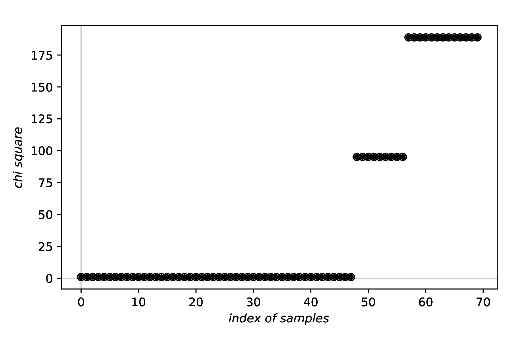

=================================================
Robust fitting via Latin Hypercube sampling (LHS)
=================================================

Classes used:

  * :class:`fitpy.analysis.LHSFit`
  * :class:`fitpy.analysis.ExtractLHSStatistics`
  * :class:`fitpy.report.LaTeXLHSFitReporter`

Instead of using informed guesses for the initial values of the variable parameters of a model, these initial values are randomly chosen using a Latin Hypercube. For each of the resulting grid points, an optimisation is performed, analogous to what has been described above.

Generally, this approach will take much longer, with the computing time scaling with the number of grid points, but it is much more robust, particularly with complicated fitness landscapes containing many local minima.

Recipe
======

.. literalinclude:: ../../examples/lhsfit/lhsfit.yaml
    :language: yaml
    :linenos:

Comments
========

* The purpose of the first block of four tasks is solely to create some data a model can be fitted to. The actual fitting starts only afterwards.

* Usually, you will have set another ASpecD-derived package as default package in your recipe for processing and analysing your data. Hence, you need to provide the package name (fitpy) in the ``kind`` property, as shown in the examples.

* Fitting is always a two-step process: (i) define the model, and (ii) define the fitting task.

* To get a quick overview of the fit results, use the dedicated plotter from the FitPy framework: :class:`fitpy.plotting.SinglePlotter1D`.

* To assess the robustness of the fit and the LHS strategy, extract one statistical criterion from the data using :class:`fitpy.analysis.ExtractLHSStatistics` and afterwards plot the results using a standard plotter from the ASpecD framework.

* For a more detailed overview, particularly in case of several fits with different settings on one and the same dataset or for a series of similar fits on different datasets, use reports, as shown here using :class:`fitpy.report.LaTeXLHSFitReporter`. This reporter will automatically create the figure showing both, fitted model and original data, as well as the figure allowing to assess the robustness of the fit.

Result
======

The two first figures created in the recipe, namely those of the data and the fit results, are basically identical to the :doc:`previous example <simplefit>` given for :class:`fitpy.analysis.SimpleFit` and are hence omitted here. Instead, the result of plotting the chi suqare values to assess the robustness of the LHS approach is shown below.

While in the recipe, the output format has been set to PDF, for rendering here the figure has been converted to PNG. Due to the LHS having an inherently random component, your figure will look different. Nevertheless, you should get the overall idea of such plot for assessing the robustness of a fit employing LHS.

    **Robustness of the fit.** As generally fitting is a minimisation problem, the lower the value of the respective criterion, the better the fit. For a rough fitness landscape, you will likely observe several *plateaus*, and ideally a visible plateau at the very left, representing the lowest (hopefully global) minimum.