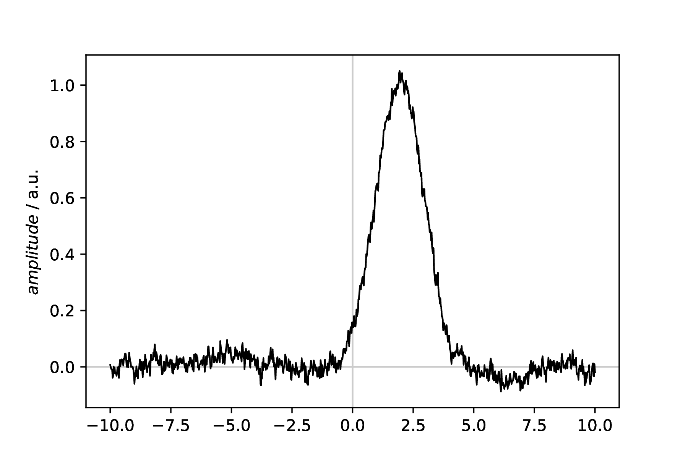
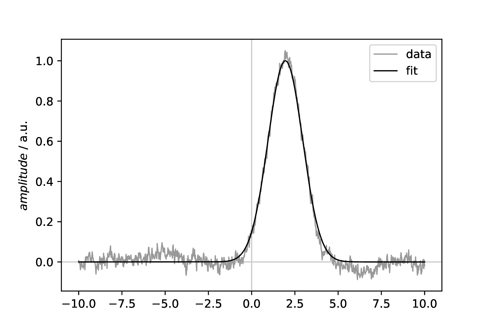

=================================
Simple fitting of single datasets
=================================

Classes used:

  * :class:`fitpy.analysis.SimpleFit`
  * :class:`fitpy.plotting.SinglePlotter1D`
  * :class:`fitpy.report.LaTeXFitReporter`

Making informed guesses for the initial values of the variable parameters of a model and fit the model to the data is the most straight-forward strategy. Still, different optimisation algorithms can be chosen. The recipe presented here uses :class:`fitpy.analysis.SimpleFit` with standard values and shows as well how to use the dedicated plotters and reporters.

Recipe
======

.. literalinclude:: ../../examples/simplefit/simplefit.yaml
    :language: yaml
    :linenos:

Comments
========

* The purpose of the first block of four tasks is solely to create some data a model can be fitted to. The actual fitting starts only afterwards.

* Usually, you will have set another ASpecD-derived package as default package in your recipe for processing and analysing your data. Hence, you need to provide the package name (fitpy) in the ``kind`` property, as shown in the examples.

* Fitting is always a two-step process: (i) define the model, and (ii) define the fitting task.

* To get a quick overview of the fit results, use the dedicated plotter from the FitPy framework: :class:`fitpy.plotting.SinglePlotter1D`.

* For a more detailed overview, particularly in case of several fits with different settings on one and the same dataset or for a series of similar fits on different datasets, use reports, as shown here using :class:`fitpy.report.LaTeXFitReporter`. This reporter will automatically create the figure showing both, fitted model and original data.

Result
======

Examples for the two figures created in the recipe are given below. While in the recipe, the output format has been set to PDF, for rendering them here they have been converted to PNG. Due to the noise added to the model having an inherently random component, your data will look slightly different. Therefore, the fit results will be slightly different as well. Nevertheless, overall it should be fairly identical.

    **Created dataset that shall be fitted.** The dataset consists of a single Gaussian line with pink (1/f) noise added to it. For this figure, a standard plotter from the ASpecD framework has been used. The fitted line together with the original data is shown in the next figure.

    **Fitted model together with the original data.** The dataset is identical to the one shown in the previous figure. For this figure, a dedicated plotter from the FitPy package, :class:`fitpy.plotting.SinglePlotter1D`, has been used that is aware of the structure of the calculated dataset resulting from the :class:`fitpy.analysis.SimpleFit` fitting step. Therefore, both, fitted model and (reconstructed) original data are displayed, together with default labels and a legend.
